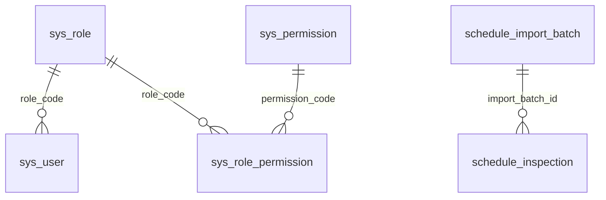

# Schedule SmartUser 数据库表设计详细说明

## 1. 数据库概览

数据库名：`schedule_smartuser`

字符集：`utf8mb4`

排序规则：`utf8mb4_unicode_ci`

数据库脚本路径：

```text
database/schema.sql
```

系统共包含 7 张核心表：

| 序号 | 表名 | 中文名称 | 说明 |
| --- | --- | --- | --- |
| 1 | `sys_role` | 系统角色表 | 保存角色基础信息 |
| 2 | `sys_user` | 系统用户表 | 保存登录账号和角色 |
| 3 | `sys_permission` | 系统权限表 | 保存功能权限编码 |
| 4 | `sys_role_permission` | 角色权限关联表 | 保存角色和权限的多对多关系 |
| 5 | `sys_menu` | 系统菜单表 | 保存前端菜单配置 |
| 6 | `schedule_import_batch` | 导入批次表 | 保存每次导入文件的统计信息 |
| 7 | `schedule_inspection` | 检查记录表 | 保存导入后的巡检明细数据 |

## 2. 表关系



关系说明：

- 一个角色可以对应多个用户。
- 一个角色可以拥有多个权限。
- 一个权限可以被多个角色拥有。
- 一个导入批次可以对应多条巡检记录。

## 3. sys_role 系统角色表

表用途：保存系统角色基础信息。

建表说明：

```sql
CREATE TABLE IF NOT EXISTS sys_role (...)
```

字段说明：

| 字段 | 类型 | 主键 | 非空 | 默认值 | 说明 |
| --- | --- | --- | --- | --- | --- |
| `code` | `VARCHAR(50)` | 是 | 是 | 无 | 角色编码，例如 `admin`、`scheduler`、`viewer` |
| `name` | `VARCHAR(100)` | 否 | 是 | 无 | 角色名称 |
| `description` | `VARCHAR(255)` | 否 | 否 | `NULL` | 角色描述 |
| `created_at` | `DATETIME` | 否 | 是 | `CURRENT_TIMESTAMP` | 创建时间 |

初始角色：

| code | name | description |
| --- | --- | --- |
| `admin` | `Administrator` | Full system access |
| `scheduler` | `Scheduler` | Can import and view route map |
| `viewer` | `Viewer` | Read-only route map access |

## 4. sys_user 系统用户表

表用途：保存系统登录用户。

字段说明：

| 字段 | 类型 | 主键 | 非空 | 默认值 | 说明 |
| --- | --- | --- | --- | --- | --- |
| `id` | `BIGINT` | 是 | 是 | 自增 | 用户 ID |
| `username` | `VARCHAR(80)` | 否 | 是 | 无 | 用户名，唯一 |
| `password_hash` | `VARCHAR(255)` | 否 | 是 | 无 | 密码哈希或历史兼容密码 |
| `real_name` | `VARCHAR(120)` | 否 | 是 | 无 | 真实姓名 |
| `role_code` | `VARCHAR(50)` | 否 | 是 | 无 | 角色编码，关联 `sys_role.code` |
| `status` | `TINYINT` | 否 | 是 | `1` | 状态：`1` 启用，`0` 禁用 |
| `created_at` | `DATETIME` | 否 | 是 | `CURRENT_TIMESTAMP` | 创建时间 |
| `updated_at` | `DATETIME` | 否 | 是 | `CURRENT_TIMESTAMP ON UPDATE CURRENT_TIMESTAMP` | 更新时间 |

约束和索引：

| 名称 | 类型 | 字段 | 说明 |
| --- | --- | --- | --- |
| 主键 | Primary Key | `id` | 自增主键 |
| 唯一约束 | Unique | `username` | 用户名不能重复 |
| 外键 | Foreign Key | `role_code -> sys_role(code)` | 用户必须属于一个角色 |

初始用户：

| username | password_hash | real_name | role_code | status |
| --- | --- | --- | --- | --- |
| `admin` | `{noop}admin123` | `System Admin` | `admin` | `1` |
| `scheduler` | `{noop}scheduler123` | `Scheduler` | `scheduler` | `1` |

说明：

- `{noop}` 是历史兼容明文密码标识。
- 新增或重置密码时，后端使用 BCrypt 加密后保存。
- 用户列表返回前会清空 `password_hash`。

## 5. sys_permission 系统权限表

表用途：保存系统功能权限编码。

字段说明：

| 字段 | 类型 | 主键 | 非空 | 默认值 | 说明 |
| --- | --- | --- | --- | --- | --- |
| `id` | `BIGINT` | 是 | 是 | 自增 | 权限 ID |
| `code` | `VARCHAR(120)` | 否 | 是 | 无 | 权限编码，唯一 |
| `name` | `VARCHAR(120)` | 否 | 是 | 无 | 权限名称 |
| `description` | `VARCHAR(255)` | 否 | 否 | `NULL` | 权限描述 |
| `created_at` | `DATETIME` | 否 | 是 | `CURRENT_TIMESTAMP` | 创建时间 |
| `updated_at` | `DATETIME` | 否 | 是 | `CURRENT_TIMESTAMP ON UPDATE CURRENT_TIMESTAMP` | 更新时间 |

初始权限：

| code | name | description |
| --- | --- | --- |
| `system:user` | User management | Manage login users |
| `system:menu` | Menu management | Manage menus |
| `system:permission` | Permission management | Manage permissions |
| `inspection:import` | Inspection import | Import csv/xls/xlsx inspection files |
| `inspection:list` | Inspection list | View imported inspection records |
| `route:map` | Routes map | View route map records |

## 6. sys_role_permission 角色权限关联表

表用途：保存角色和权限的关联关系。

字段说明：

| 字段 | 类型 | 主键 | 非空 | 默认值 | 说明 |
| --- | --- | --- | --- | --- | --- |
| `role_code` | `VARCHAR(50)` | 联合主键 | 是 | 无 | 角色编码，关联 `sys_role.code` |
| `permission_code` | `VARCHAR(120)` | 联合主键 | 是 | 无 | 权限编码，关联 `sys_permission.code` |

约束：

| 名称 | 类型 | 字段 | 说明 |
| --- | --- | --- | --- |
| 主键 | Composite Primary Key | `role_code, permission_code` | 同一角色不能重复拥有同一权限 |
| 外键 | Foreign Key | `role_code -> sys_role(code)` | 角色必须存在 |
| 外键 | Foreign Key | `permission_code -> sys_permission(code)` | 权限必须存在 |

初始授权：

| role_code | 权限 |
| --- | --- |
| `admin` | `system:user`、`system:menu`、`system:permission`、`inspection:import`、`inspection:list`、`route:map` |
| `scheduler` | `inspection:import`、`inspection:list`、`route:map` |
| `viewer` | `inspection:list`、`route:map` |

## 7. sys_menu 系统菜单表

表用途：保存前端左侧菜单配置。

字段说明：

| 字段 | 类型 | 主键 | 非空 | 默认值 | 说明 |
| --- | --- | --- | --- | --- | --- |
| `id` | `BIGINT` | 是 | 是 | 自增 | 菜单 ID |
| `parent_id` | `BIGINT` | 否 | 是 | `0` | 父菜单 ID |
| `name` | `VARCHAR(120)` | 否 | 是 | 无 | 菜单名称 |
| `path` | `VARCHAR(200)` | 否 | 是 | 无 | 前端路由路径 |
| `component` | `VARCHAR(120)` | 否 | 否 | `NULL` | 前端组件名称 |
| `permission_code` | `VARCHAR(120)` | 否 | 否 | `NULL` | 权限编码 |
| `sort_order` | `INT` | 否 | 是 | `100` | 排序号 |
| `visible` | `TINYINT` | 否 | 是 | `1` | 是否可见：`1` 是，`0` 否 |
| `created_at` | `DATETIME` | 否 | 是 | `CURRENT_TIMESTAMP` | 创建时间 |
| `updated_at` | `DATETIME` | 否 | 是 | `CURRENT_TIMESTAMP ON UPDATE CURRENT_TIMESTAMP` | 更新时间 |

索引：

| 名称 | 类型 | 字段 | 说明 |
| --- | --- | --- | --- |
| `uk_sys_menu_path` | Unique | `path` | 菜单路径唯一 |
| `idx_sys_menu_sort` | Index | `sort_order, id` | 菜单排序 |

初始菜单：

| name | path | component | permission_code | sort_order |
| --- | --- | --- | --- | --- |
| Dashboard | `/dashboard` | `DashboardHome` | `NULL` | 10 |
| User Management | `/system/users` | `UsersView` | `system:user` | 20 |
| Menu Management | `/system/menus` | `MenusView` | `system:menu` | 30 |
| Permission Management | `/system/permissions` | `PermissionsView` | `system:permission` | 40 |
| Inspection Import | `/inspections/import` | `ImportView` | `inspection:import` | 50 |
| Routes map | `/routes/map` | `RoutesMapView` | `route:map` | 60 |

## 8. schedule_import_batch 导入批次表

表用途：记录每次上传文件的导入统计信息。

字段说明：

| 字段 | 类型 | 主键 | 非空 | 默认值 | 说明 |
| --- | --- | --- | --- | --- | --- |
| `id` | `BIGINT` | 是 | 是 | 自增 | 批次 ID |
| `file_name` | `VARCHAR(255)` | 否 | 是 | 无 | 上传文件名 |
| `file_type` | `VARCHAR(30)` | 否 | 是 | 无 | 文件类型，例如 `csv`、`xls`、`xlsx` |
| `total_rows` | `INT` | 否 | 是 | `0` | 扫描总行数 |
| `success_rows` | `INT` | 否 | 是 | `0` | 成功导入行数 |
| `failed_rows` | `INT` | 否 | 是 | `0` | 失败行数 |
| `created_by` | `VARCHAR(80)` | 否 | 否 | `NULL` | 创建人 |
| `created_at` | `DATETIME` | 否 | 是 | `CURRENT_TIMESTAMP` | 创建时间 |

业务说明：

- 每次导入文件都会创建一条批次记录。
- `schedule_inspection.import_batch_id` 关联该表。
- 批次统计用于前端导入结果提示和数据追踪。

## 9. schedule_inspection 检查记录表

表用途：保存导入后的每一条客户巡检记录，是 Inspection Import 和 Routes map 的核心业务表。

字段说明：

| 字段 | 类型 | 主键 | 非空 | 默认值 | 说明 |
| --- | --- | --- | --- | --- | --- |
| `id` | `BIGINT` | 是 | 是 | 自增 | 记录 ID |
| `import_batch_id` | `BIGINT` | 否 | 否 | `NULL` | 导入批次 ID，关联 `schedule_import_batch.id` |
| `row_num` | `INT` | 否 | 否 | `NULL` | 源文件行号 |
| `day_of_week` | `VARCHAR(120)` | 否 | 否 | `NULL` | 星期或模板中的 Day 信息 |
| `status` | `VARCHAR(120)` | 否 | 否 | `NULL` | 状态，例如导入状态或 `Cancelled` |
| `mac_id` | `VARCHAR(80)` | 否 | 否 | `NULL` | MAC ID |
| `sales` | `VARCHAR(160)` | 否 | 否 | `NULL` | 销售人员 |
| `first_name` | `VARCHAR(120)` | 否 | 否 | `NULL` | 名 |
| `last_name` | `VARCHAR(120)` | 否 | 否 | `NULL` | 姓 |
| `customer_name` | `VARCHAR(240)` | 否 | 否 | `NULL` | 客户名称，由名和姓拼接 |
| `phone_number` | `VARCHAR(60)` | 否 | 否 | `NULL` | 电话号码 |
| `address` | `VARCHAR(500)` | 否 | 否 | `NULL` | 地址 |
| `suburb` | `VARCHAR(160)` | 否 | 否 | `NULL` | 区域 / 郊区 |
| `city_council` | `VARCHAR(160)` | 否 | 否 | `NULL` | 市议会 |
| `inspector` | `VARCHAR(120)` | 否 | 否 | `NULL` | 检查员 |
| `inspection_date` | `DATE` | 否 | 否 | `NULL` | 检查日期 |
| `inspection_time` | `VARCHAR(60)` | 否 | 否 | `NULL` | 检查时间 |
| `projects` | `VARCHAR(160)` | 否 | 否 | `NULL` | 产品 / 项目 |
| `scheduler_remarks` | `TEXT` | 否 | 否 | `NULL` | 调度备注，也作为 Routes map 的 Note 主要保存字段 |
| `quotation_team_report` | `TEXT` | 否 | 否 | `NULL` | 报价团队报告 |
| `raw_json` | `LONGTEXT` | 否 | 否 | `NULL` | 标准化后的原始导入行 JSON |
| `created_at` | `DATETIME` | 否 | 是 | `CURRENT_TIMESTAMP` | 创建时间 |
| `updated_at` | `DATETIME` | 否 | 是 | `CURRENT_TIMESTAMP ON UPDATE CURRENT_TIMESTAMP` | 更新时间 |

索引：

| 名称 | 类型 | 字段 | 说明 |
| --- | --- | --- | --- |
| `idx_schedule_inspection_batch` | Index | `import_batch_id` | 按导入批次查询 |
| `idx_schedule_inspection_date` | Index | `inspection_date` | 按日期筛选 |
| `idx_schedule_inspection_inspector` | Index | `inspector` | 按检查员 / 路线筛选 |
| `idx_schedule_inspection_mac` | Index | `mac_id` | 按 MAC 查询 |

外键：

| 名称 | 字段 | 关联表 | 说明 |
| --- | --- | --- | --- |
| `fk_schedule_inspection_batch` | `import_batch_id` | `schedule_import_batch(id)` | 巡检记录来源批次 |

## 10. 导入字段映射

导入服务会标准化表头，去除 BOM、空格、大小写和特殊符号差异。常见映射如下：

| 导入标准化字段 | 数据库字段 | 说明 |
| --- | --- | --- |
| `daydate` | `day_of_week` | Day / Date 分组信息 |
| `status` | `status` | 状态 |
| `macid` | `mac_id` | MAC ID |
| `sales` | `sales` | 销售 |
| `firstname` | `first_name` | 名 |
| `lastname` | `last_name` | 姓 |
| `phonenumber` | `phone_number` | 电话 |
| `address` | `address` | 地址 |
| `suburb` | `suburb` | 区域 |
| `citycouncil` | `city_council` | 市议会 |
| `inspector` | `inspector` | 检查员 |
| `inspectiondate` | `inspection_date` | 检查日期 |
| `inspectiontime` | `inspection_time` | 检查时间 |
| `projects` | `projects` | 产品 |
| `remarksschedulerteam` | `scheduler_remarks` | 调度备注 |
| `quotationteamreport` | `quotation_team_report` | 报价团队报告 |

有效数据行判断：

- `macid`
- `address`
- `phonenumber`
- `firstname`
- `lastname`

以上任意一个字段有值，即认为是有效业务行。

## 11. 数据维护规则

### 11.1 单表 SQL

当前系统单表增删改查使用 MyBatis-Plus。

对应 Mapper：

- `UserMapper`
- `MenuMapper`
- `PermissionMapper`
- `RolePermissionMapper`
- `ImportBatchMapper`
- `InspectionMapper`

### 11.2 多表 SQL

后续如增加多表查询，应使用 MyBatis XML。

建议目录：

```text
backend/src/main/resources/mapper
```

`application.yml` 已保留：

```yaml
mybatis-plus:
  mapper-locations: classpath*:/mapper/**/*.xml
```

### 11.3 删除规则

| 操作 | 表 | 说明 |
| --- | --- | --- |
| 单条删除巡检记录 | `schedule_inspection` | 按主键物理删除 |
| 批量删除巡检记录 | `schedule_inspection` | 按 ID 列表物理删除 |
| 条件删除巡检记录 | `schedule_inspection` | 按当前查询条件物理删除 |
| 取消巡检记录 | `schedule_inspection` | 不删除，仅把 `status` 更新为 `Cancelled` |

## 12. 建议备份策略

建议定期备份以下表：

- `schedule_import_batch`
- `schedule_inspection`
- `sys_user`
- `sys_role_permission`
- `sys_menu`

建议在执行“删除全部”类操作前备份 `schedule_inspection` 表。

