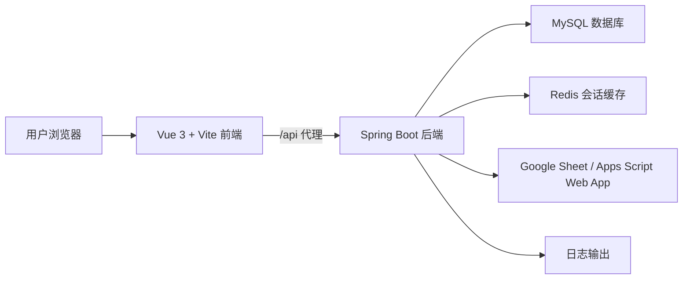
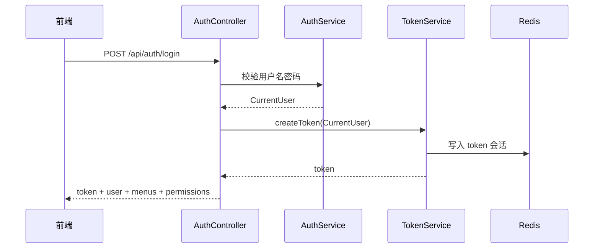
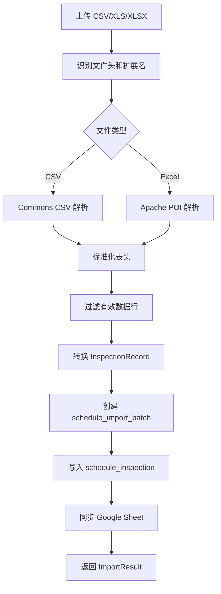

# Schedule SmartUser 系统技术架构设计

## 1. 系统定位

Schedule SmartUser 是一个巡检排班和路线数据管理系统。系统通过 CSV / Excel 导入客户巡检数据，写入 MySQL 后在前端提供查询、编辑、导出、删除、路线查看和 Google Sheet 同步能力。

## 2. 总体架构



## 3. 技术栈

| 层级 | 技术 | 版本 / 说明 |
| --- | --- | --- |
| 前端框架 | Vue 3 | `vue 3.4.x` |
| 前端构建 | Vite | `vite 4.5.x` |
| 前端路由 | Vue Router | `vue-router 4.3.x` |
| HTTP 客户端 | Axios | `axios 1.6.x` |
| 后端框架 | Spring Boot | `2.7.18` |
| Java | JDK 17 | Maven `java.version=17` |
| ORM | MyBatis-Plus | `3.5.7` |
| 数据库 | MySQL | MySQL Connector/J `8.0.33` |
| 连接池 | HikariCP | Spring Boot 默认连接池 |
| 会话缓存 | Redis | Spring Data Redis |
| 密码加密 | BCrypt | Spring Security Crypto |
| 文件解析 | Apache Commons CSV / Apache POI | CSV、XLS、XLSX |
| Google 同步 | Google Sheets API / Apps Script Web App | 支持服务账号和 Web App 两种方式 |

## 4. 前端架构

### 4.1 目录结构

```text
frontend/src
├─ api/http.js              # Axios 实例、token 注入、响应处理、错误处理
├─ router/index.js          # 前端路由和登录守卫
├─ store/auth.js            # 登录态、用户、菜单、权限缓存
├─ utils/logger.js          # 前端统一 info/error 日志
├─ views
│  ├─ LoginView.vue         # 登录页
│  ├─ MainLayout.vue        # 主布局和左侧菜单
│  ├─ DashboardHome.vue     # 首页模块概览
│  ├─ UsersView.vue         # 用户管理
│  ├─ MenusView.vue         # 菜单管理
│  ├─ PermissionsView.vue   # 权限管理
│  ├─ ImportView.vue        # 巡检导入和导入记录维护
│  └─ RoutesMapView.vue     # 路线地图和路线记录维护
└─ styles.css               # 全局样式
```

### 4.2 路由设计

| 路径 | 组件 | 说明 |
| --- | --- | --- |
| `/login` | `LoginView` | 登录页 |
| `/dashboard` | `DashboardHome` | 系统首页 |
| `/system/users` | `UsersView` | 用户管理 |
| `/system/menus` | `MenusView` | 菜单管理 |
| `/system/permissions` | `PermissionsView` | 权限管理 |
| `/inspections/import` | `ImportView` | 数据导入和导入记录维护 |
| `/routes/map` | `RoutesMapView` | 路线地图和路线记录维护 |

路由守卫规则：

- 未登录用户访问非 `/login` 页面时跳转到 `/login`。
- 已登录用户访问 `/login` 时跳转到 `/dashboard`。

### 4.3 前端请求处理

`frontend/src/api/http.js` 统一处理：

- 基础路径 `/api`。
- 请求超时 `120000ms`。
- 从 localStorage 读取 `schedule_token` 并写入 `Authorization: Bearer <token>`。
- 后端响应统一拆包 `ApiResponse.data`。
- `401` 时清理本地登录态并跳转登录页。
- 输出前端请求 info/error 日志。

### 4.4 前端状态管理

`frontend/src/store/auth.js` 使用 Vue `reactive` 保存：

| 状态 | localStorage key | 说明 |
| --- | --- | --- |
| token | `schedule_token` | 登录 token |
| user | `schedule_user` | 当前用户 |
| menus | `schedule_menus` | 菜单列表 |
| permissions | `schedule_permissions` | 权限编码列表 |

## 5. 后端架构

### 5.1 分层结构

```text
backend/src/main/java/com/smartuser/schedule
├─ controller   # REST 接口层
├─ service      # 业务逻辑层
├─ mapper       # MyBatis-Plus 单表 Mapper
├─ model        # 数据库实体和接口入参/返回对象
├─ config       # Web、鉴权、MyBatis-Plus、异常、日志、Google 配置
├─ common       # 通用响应和业务异常
└─ tools        # 数据库初始化工具
```

### 5.2 Controller 层

| Controller | 基础路径 | 说明 |
| --- | --- | --- |
| `AuthController` | `/api/auth` | 登录、当前用户、退出 |
| `SystemController` | `/api/system` | 用户、菜单、权限管理 |
| `InspectionController` | `/api/inspections` | 导入、导入记录维护、导出、Google Sheet 状态 |
| `RouteController` | `/api/routes` | 路线选项、路线地图、路线导出 |
| `HealthController` | `/api/health` | 健康检查 |

### 5.3 Service 层

| Service | 说明 |
| --- | --- |
| `AuthService` | 用户名密码校验、用户转当前会话对象 |
| `TokenService` | token 生成、Redis 会话、内存兜底、退出清理 |
| `PasswordService` | BCrypt 加密、兼容历史 `{noop}` 和明文密码 |
| `SystemService` | 用户、菜单、权限、角色权限查询维护 |
| `InspectionService` | 文件导入、分页查询、编辑、取消、删除、导出、路线统计 |
| `GoogleSheetSyncService` | Google Sheet 状态检查和导入数据同步 |

### 5.4 Mapper 层

当前项目 Mapper 均为 MyBatis-Plus 单表 Mapper：

| Mapper | 表 | 说明 |
| --- | --- | --- |
| `UserMapper` | `sys_user` | 用户表 |
| `MenuMapper` | `sys_menu` | 菜单表 |
| `PermissionMapper` | `sys_permission` | 权限表 |
| `RolePermissionMapper` | `sys_role_permission` | 角色权限表 |
| `ImportBatchMapper` | `schedule_import_batch` | 导入批次表 |
| `InspectionMapper` | `schedule_inspection` | 巡检记录表 |

SQL 约定：

- 单表操作使用 MyBatis-Plus。
- 多表或复杂 SQL 应新增 MyBatis XML 映射文件，放在 `resources/mapper` 约定路径下。

## 6. 鉴权架构



接口鉴权由 `AuthInterceptor` 完成：

- 放行 `OPTIONS`。
- 放行 `/api/auth/login`。
- 放行 `/api/health/**`。
- 其他 `/api/**` 请求必须携带 `Authorization: Bearer <token>`。
- 鉴权成功后将 `CurrentUser` 放入 request 属性。

Redis 不可用时，`TokenService` 会使用本地内存会话兜底，方便本地开发。

## 7. 文件导入架构



导入规则：

- 通过真实文件头判断 `xlsx`、`xls`。
- CSV 使用 UTF-8 读取。
- Excel 读取第一个 Sheet。
- 第一行作为表头。
- 表头会去除 BOM、大小写差异和非字母数字字符。
- 有 MAC、地址、电话、名、姓任一核心字段才认为是有效数据行。
- 导入行原始字段会保存为 `raw_json`，便于追踪。

## 8. Routes map 架构

Routes map 使用 `schedule_inspection` 表数据。

核心逻辑：

- 路线按 `inspector` 聚合。
- 空 `inspector` 或空字符串显示为 `Unassigned`。
- 页面统计包括路线组数、巡检记录数、未排时间数量、最早日期。
- 列表支持分页，默认每页 10 条。
- 支持按日期和路线筛选。
- 支持选择导出、全部导出、选择删除、条件删除。
- `Inspector`、`Date`、`Time`、`Product`、`Note` 编辑后点击行内 `Save` 按钮持久化保存。

## 9. Google Sheet 同步架构

系统支持两种同步方式：

### 9.1 服务账号方式

后端读取以下任一配置：

- `GOOGLE_SHEET_SERVICE_ACCOUNT_FILE`
- `GOOGLE_SHEET_SERVICE_ACCOUNT_JSON`
- `GOOGLE_SHEET_SERVICE_ACCOUNT_BASE64`

流程：

1. 读取服务账号凭据。
2. 使用 JWT Bearer 流程换取 access token。
3. 按 `spreadsheet-id` 和 `sheet-gid` 定位 Sheet。
4. 如首行为空则写入表头。
5. 追加导入数据行。

### 9.2 Apps Script Web App 方式

后端读取：

- `GOOGLE_SHEET_WEB_APP_URL`
- `GOOGLE_SHEET_WEB_APP_SECRET`

流程：

1. 后端向 Web App 发送 JSON。
2. Web App 校验 secret。
3. Web App 根据 Spreadsheet ID 和 Sheet gid 定位目标页签。
4. 写入表头并追加数据。
5. 返回 JSON 结果。

当前推荐 Apps Script Web App 方式，部署说明见 `docs/GoogleSheet同步部署说明.md`。

## 10. 日志架构

后端日志包括：

| 日志 | 来源 | 说明 |
| --- | --- | --- |
| 接口日志 | `ExecutionLogAspect` | 记录 Controller 请求路径、用户、参数摘要、耗时、异常 |
| 业务日志 | `ExecutionLogAspect` | 记录 Service 方法、参数摘要、耗时、异常 |
| 导入日志 | `InspectionService` | 记录文件解析、批次创建、数据库写入、导出 |
| Google 日志 | `GoogleSheetSyncService` | 记录状态检查、同步方式、请求结果、网络异常 |
| 异常日志 | `GlobalExceptionHandler` | 记录业务异常、重复数据、数据库连接异常、系统异常 |

敏感字段脱敏：

- password
- token
- authorization
- secret
- private_key
- service_account

## 11. 配置设计

主要配置位于 `backend/src/main/resources/application.yml`。

| 配置段 | 说明 |
| --- | --- |
| `server.port` | 后端端口，默认 `8088` |
| `spring.datasource` | MySQL 连接 |
| `spring.datasource.hikari` | HikariCP 连接池 |
| `spring.redis` | Redis 会话缓存 |
| `spring.servlet.multipart` | 上传文件大小限制 |
| `schedule.auth.token-ttl-seconds` | token 有效期，默认 8 小时 |
| `integration.google-sheet` | Google Sheet 同步配置 |
| `mybatis-plus` | MyBatis-Plus 配置 |
| `logging` | 日志级别和字符集 |

## 12. 部署与运行

### 12.1 后端构建

```powershell
cd D:\DOC\07_众方CRM\04_schedule\02_schedule-smartuser
mvn.cmd -q -f backend\pom.xml -DskipTests package
```

### 12.2 后端启动

```powershell
cd D:\DOC\07_众方CRM\04_schedule\02_schedule-smartuser\backend
java -Dfile.encoding=UTF-8 -jar target\schedule-smartuser-backend-1.0.0.jar
```

### 12.3 前端开发启动

```powershell
cd D:\DOC\07_众方CRM\04_schedule\02_schedule-smartuser\frontend
npm install
npm run dev
```

### 12.4 前端构建

```powershell
cd D:\DOC\07_众方CRM\04_schedule\02_schedule-smartuser\frontend
npm run build
```

## 13. 安全设计

- 登录后使用 token 访问后端接口。
- 后端不返回密码哈希。
- 新密码使用 BCrypt 加密。
- 历史 `{noop}` 密码仅用于兼容初始化数据。
- Google 普通邮箱密码不能作为后端同步凭据。
- 日志切面对敏感字段脱敏。
- 删除操作前端有确认提示。

## 14. 扩展建议

后续可扩展方向：

- 增加角色权限关系维护页面。
- 增加导入批次列表和按批次回滚。
- 增加 Google Sheet 同步重试队列。
- 增加操作审计表。
- 将 Routes map 路线分组从 `inspector` 扩展为独立路线表。
- 为多表统计新增 MyBatis XML 映射文件。
